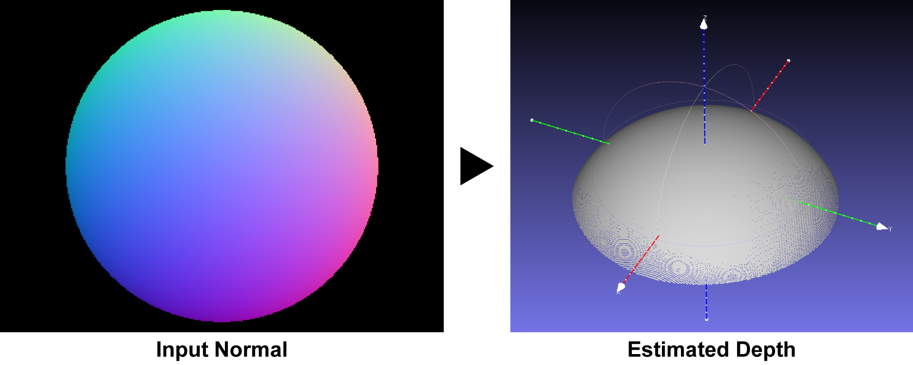

# normal2depth
Estimate depth from surface normal

<div align="center">
  
</div>

## Environment
Ubuntu 18.04  
Python3.6(Anaconda3-5.2.0)


## Dependency

+ OpenCV3
+ numpy
+ sys
+ os
+ scipy


## Usage


```
python main.py argvs[1] argvs[2]

-->
argvs[1]  :  path to normal image
argvs[2]  :  path to mask for image 

```

